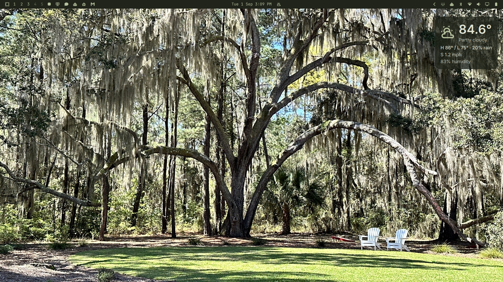

# Spanish Moss — an Omarchy theme

A dark theme for [Omarchy](https://omarchy.org) derived from a live oak
draped in Spanish moss: deep moss-shadow surfaces, silvery sage accent,
lawn greens, and a whisper of silver-blue sky.



## Install

```bash
omarchy theme install https://github.com/unw1red/omarchy-theme-spanish-moss.git
```

Then apply it:

```bash
omarchy theme set spanish-moss
```

## Palette

| Role | Color |
|------|-------|
| Accent (silver moss) | `#b5bf9c` |
| Background (deep moss shadow) | `#20241a` |
| Foreground (pale moss cream) | `#dfe2d2` |
| Lawn green | `#a2aa70` |
| Sunlit moss gold | `#d6d9a7` |
| Sky silver-blue | `#aec6c8` |
| Water slate | `#86a5b8` |

## Contents

- `colors.toml` — the palette. Terminal configs, Hyprland, Neovim, VS Code,
  btop, and the rest of the themed apps are regenerated from this by Omarchy,
  so the repo intentionally ships nothing that executes.
- `shell.toml` — sage-moss bar widget icons on the dark bar.
- `backgrounds/` — the photograph the palette was extracted from.
- `preview.png` — thumbnail for the theme switcher.

Pairs well with its sibling theme
[The Marsh](https://github.com/unw1red/omarchy-theme-the-marsh).

## License

MIT — see [LICENSE](LICENSE). The background photograph is by the theme
author.